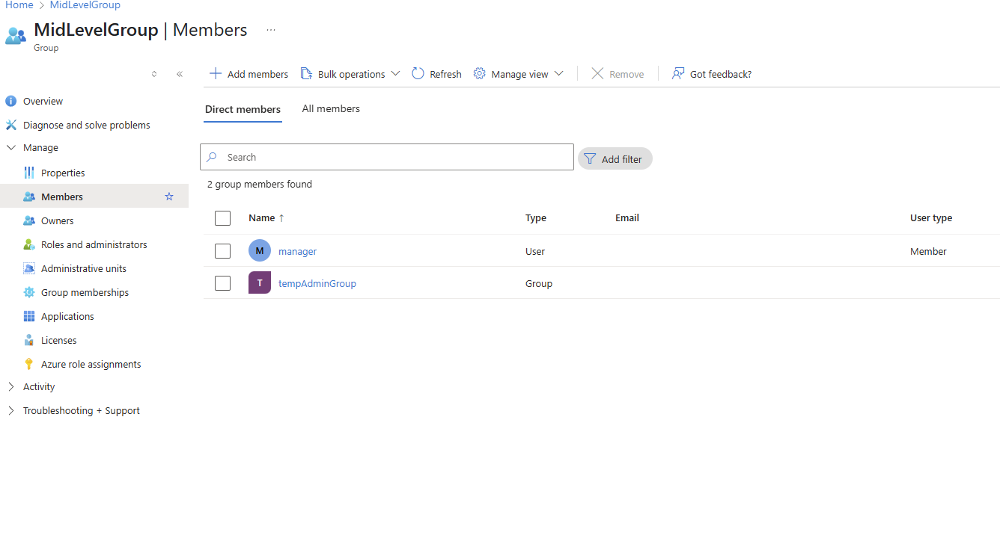

# Escalation by Design: How I Inherited Blob Access in Azure Without Direct Permissions

## The Challenge

In this project, I simulated a **real-world privilege escalation** in Azure. The goal: prove that a seemingly harmless user (`manager`) could access a private blob storage container through **nested group inheritance** — without any direct role assignment.

## Environment Overview

**Azure Tenant**: Free-tier  
**Target User**: `manager`  
**Groups**: `MidLevelGroup`, `tempAdminGroup`, `StorageAccessGroup`  
**Resource**: Storage Account `ctfstorage12345`  
**Blob Container**: `ctf-container`  
**Flag File**: `flag.txt` (private, sensitive marker)

## Nested Group Design

I built an escalation chain using Azure AD Security Groups:

**manager**
->MidLevelGroup
  ->tempAdminGroup
      ->StorageAccessGroup (has *Storage Blob Data Contributor role*)

The role was only applied to `StorageAccessGroup`. `manager` only belonged to `MidLevelGroup`. If the inheritance worked, access would be silently escalated.

## ⚔️ The Access Attempts

**Azure Portal**: ❌ “Access Denied”  
**Browser URL**: ❌ “Public Access Not Permitted”  
**Azure Storage Explorer**: ❌ No subscriptions found  
**Azure CLI**: ✅ Eventual success

I tested access across several interfaces to validate propagation paths.

## Azure CLI: Proof of Access

**Once Azure AD had time to propagate (~45 minutes), I used the CLI to access the blob:**

az login --allow-no-subscriptions

az storage blob list \
  --account-name ctfstorage12345 \
  --container-name ctf-container \
  --auth-mode login \
  --output table
✅ The output revealed flag.txt. Access was confirmed.

**I then downloaded it using:**

az storage blob download \
  --account-name ctfstorage12345 \
  --container-name ctf-container \
  --name flag.txt \
  --file ./flag_by_manager.txt \
  --auth-mode login

## 🛡 Detection & Remediation

**What to monitor in the real world**:

- Run az role assignment list on critical resources
- Identify indirect role inheritance through nested groups
- Audit users with access to storage blobs using Check Access in IAM blade

**How to fix misconfigurations like this**:

- Flatten IAM group hierarchy when possible
- Avoid deeply nested roles without visibility
- Apply roles closer to the user/resource
- Implement Conditional Access and monitoring alerts

## Collected Proofs

## IAM Takeaway
Even with proper group nesting and role assignment, Azure RBAC propagation lag caused up to 1 hour of invisible permission mismatch — highlighting how slow privilege changes can expose security blind spots.
This is the kind of problem that’s hard to detect in the real world — and exactly the kind of thing IAM engineers and SOC teams need to understand deeply.

## What I Learned
IAM isn't just about assigning roles — it's about how they propagate and inherit

Azure’s delay in applying RBAC roles can create temporary access mismatches

Nested groups = power + risk. Every layer hides intent.

